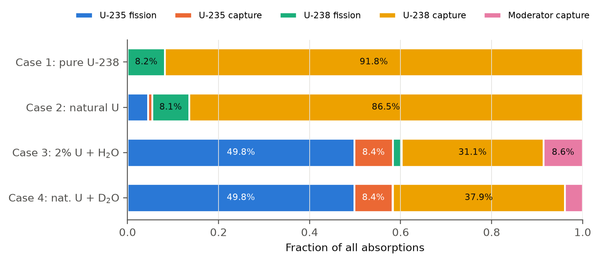
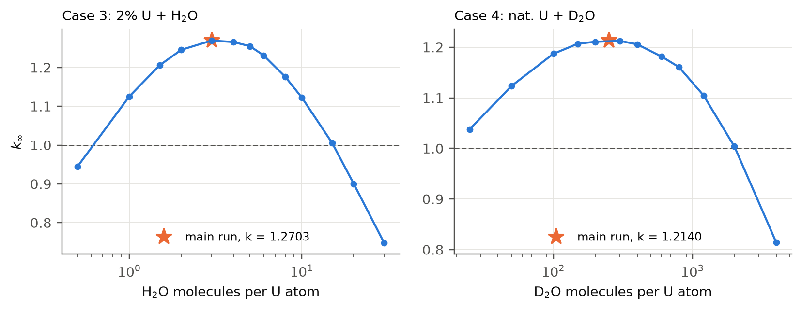

# Monte Carlo Neutron Simulation (CH 5960, Assignment 1)

This project follows neutrons one at a time through four reactor materials. From that it works out
**k∞**, the average number of new neutrons each neutron produces.
If k∞ is above 1, the material can sustain a chain reaction.

## The simulations have already been run

You do **not** need to run anything to see the results. Both runs are done, and all four cases are
included:

| Run | Neutrons per case | Results folder |
|---|---|---|
| Quick run | 1 million | [`results_1e6/`](results_1e6/) |
| Full run | 1 billion | [`results_1e9/`](results_1e9/) |

To see the results, open [`results_1e9/summary.md`](results_1e9/summary.md) for all the numbers and
the `fig1` … `fig6` images in the same folder for the plots.

## Results

| Case | k∞ with 1 million neutrons | k∞ with 1 billion neutrons | Chain reaction possible? |
|---|---|---|---|
| 1. Pure U-238 | 0.2301 ± 0.0008 | 0.22992 ± 0.00002 | No |
| 2. Natural uranium (0.72% U-235) | 0.3386 ± 0.0009 | 0.33816 ± 0.00003 | No |
| 3. 2% enriched uranium + light water (H₂O) | 1.2692 ± 0.0012 | 1.27030 ± 0.00004 | **Yes** |
| 4. Natural uranium + heavy water (D₂O) | 1.2135 ± 0.0012 | 1.21403 ± 0.00004 | **Yes** |

The two runs agree within their uncertainty. The 1 billion run is about 30 times more precise,
which is why the number after ± is much smaller.

### Where do the neutrons end up?



In cases 1 and 2, most neutrons (87–92%) are captured by U-238 (yellow) without causing fission,
so k∞ stays far below 1. When water is added (cases 3 and 4), it slows the neutrons down.
About half of them then cause fission in U-235 (blue), which is why those two cases are above 1.

### How much water is best?



Too little water and the neutrons are not slowed down enough. Too much water and the water itself
absorbs too many neutrons. k∞ is highest in between. The ★ marks the mixture used in the main runs,
which is close to the best point. A chain reaction is possible wherever the curve is above the
dashed line at k∞ = 1.

## What's in this folder

| File or folder | What it is |
|---|---|
| `mc_reactor.py` | Runs the simulation |
| `analyze.py` | Makes the plots and tables from the saved results |
| `xs_data.py` | Nuclear data (cross-sections) that the simulation uses |
| `results_1e6/` | Results with 1 million neutrons per case |
| `results_1e9/` | Results with 1 billion neutrons per case |
| `results_1e6_analog/` | An extra check of cases 3 and 4 using a slower, more detailed method |
| `results_scan/` | How k∞ changes as more water is added (cases 3 and 4) |

Inside each results folder:
- `summary.md` holds all the numbers in tables.
- `fig1` … `fig6` are the plots.
- `case1.npz` … `case4.npz` are the raw data saved by the simulation.

## Want to run it yourself?

You only need this section if you want to repeat the runs or change something.

### Step 1: Install the packages (once)

You need Python 3.9 or newer. Then run:

```
pip install numpy numba matplotlib
```

### Step 2: Try the quick run first (1 million neutrons)

Open a terminal in this folder and run:

```
python mc_reactor.py --n 1e6 --out my_results_1e6
python analyze.py my_results_1e6
```

This takes about 15 seconds. The very first run is a bit slower because the code is compiled first.
When it finishes, open `my_results_1e6/summary.md`.

> **Use a new folder name** such as `my_results_1e6`. If you give the name of a folder that already
> has results (like `results_1e6`), the program sees that the work is already done and doesn't
> run it again.

### Step 3 (optional): The full run (1 billion neutrons)

```
python mc_reactor.py --n 1e9 --out my_results_1e9
python analyze.py my_results_1e9 --scan results_scan/scan.json --analog results_1e6_analog
```

- It takes about **1 hour on an 8-core computer**, or about 2 hours on 4 cores.
- Keep the computer plugged in and stop it from going to sleep.
- It is safe to stop. If it stops, or you press Ctrl+C, run the same command again and it carries on
  from where it left off.

### Other things you can try

```
python mc_reactor.py --n 1e6 --cases 3 --out my_case3      # run only case 3
python mc_reactor.py --scan --out my_scan                  # k∞ vs. amount of water
python mc_reactor.py --n 1e6 --threads 4 --out my_test     # use only 4 CPU cores
```

## How the simulation works (short version)

1. A neutron is born from fission with a random energy.
2. It flies a random distance and then hits an atom.
3. At each hit it either **bounces off** and loses some energy, or it is **absorbed**.
   If it is absorbed by uranium, it may cause **fission**, which releases new neutrons.
4. This repeats until the neutron is absorbed. The material is infinitely large, so no neutron escapes.
5. **k∞ = (new neutrons from fission) ÷ (neutrons started)**

Repeating this for millions or billions of neutrons makes the average very precise.

<details>
<summary>Technical details of the model</summary>

- Infinite homogeneous medium (no leakage): k∞ = (ν-weighted fissions) / (neutrons started).
- Birth energy sampled exactly from s(E) = 0.771 √E e^(−0.776E) (a Maxwellian with T = 1/0.776 MeV).
- Distance to collision −ln ξ / Σt(E); nuclide and reaction chosen by Σx/Σt.
- Elastic scattering isotropic in the CM frame (E′ uniform in [αE, E]); inelastic via an evaporation spectrum.
- U-238 resolved resonances 6.67–190 eV evaluated point-wise (single-level Breit–Wigner, 0 K), so resonance
  self-shielding comes out of the simulation itself.
- Below 5kT = 0.127 eV a scatter puts the neutron in thermal equilibrium (energy re-drawn from the
  293.6 K Maxwellian). Because every absorber is 1/v at thermal energies, the absorption rate per unit
  time Σa·v is constant, so the default mode samples the whole thermal stage in one exact step
  (exponential thermal lifetime + energy-independent absorption channel). `--analog` follows every thermal
  collision; both give the same k∞, thermal lifetime and absorption rates (see `summary.md`).
- Energy groups: fast ≥ 0.1 MeV, slowing-down 0.625 eV – 0.1 MeV, thermal < 0.625 eV.
- Uranium metal (19.05 g/cm³), H₂O (1.000 g/cm³), D₂O (1.105 g/cm³) mixed homogeneously.
  Case 3: 3 H₂O per U atom; case 4: 250 D₂O per U atom (both near the k∞ maximum of the scan).

</details>
